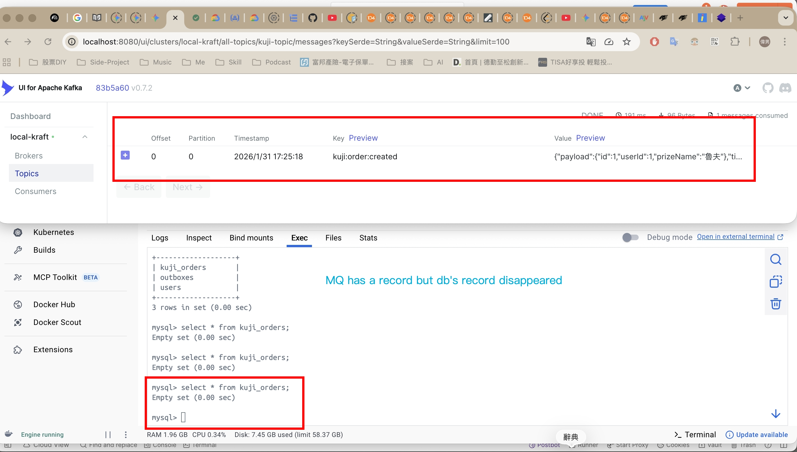
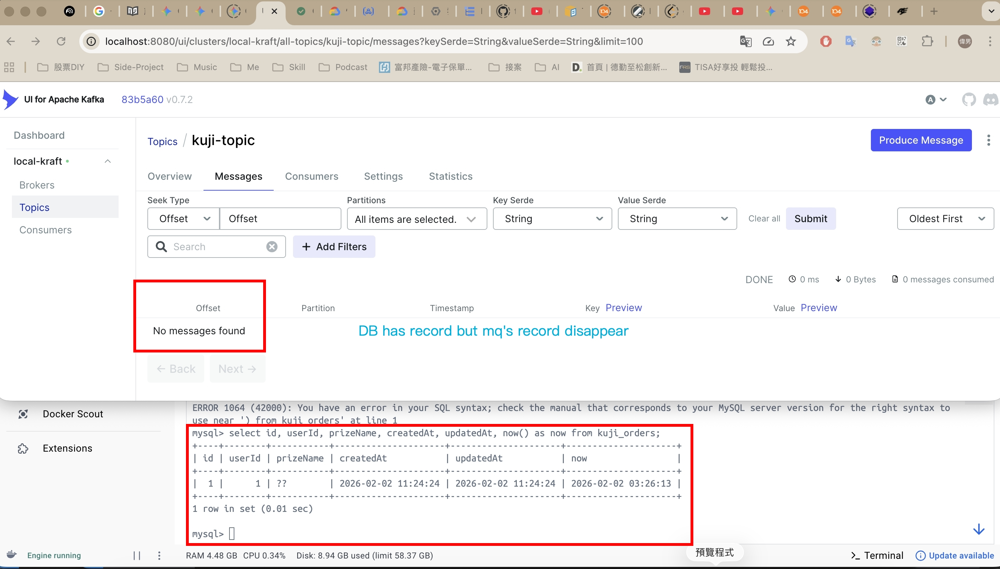
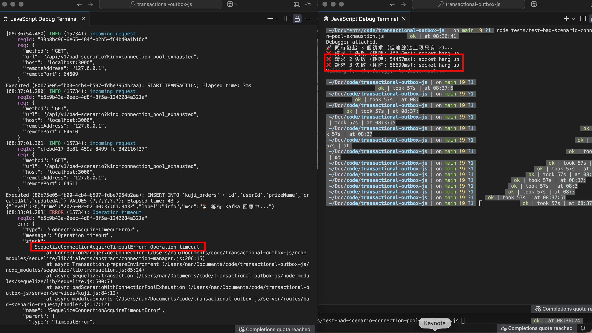

# Topic - dual write
#### 1. 👻 The "Zombie Data" Scenario (Ghost Message)
>  Issue: Kafka receives the message, but the Database Transaction fails (Rollback).
- Logic Flow:
  - Open DB Transaction.
  - Execute Order Creation.
  - Send Kafka Message (Success).
  - (Failure) The DB Transaction fails to commit or the connection is forcibly closed.
- Disastrous Result: "Message exists, but Order does not."
  - Downstream systems (e.g., Shipping, Billing) receive the Kafka message and start processing (e.g., shipping goods).
  - When these systems call back to verify order details, the API returns 404 Not Found.
  - Business Impact: Financial loss due to "free" goods being shipped for orders that never legally existed in the system.
- test
  - `npm run test-scenario`
  - postman: `[get] http://localhost:3000/api/v1/bad-scenario?kind=db`

#### 2. 🕳️ The "Message Black Hole" Scenario (Data Loss)
> Issue: Database commit is successful, but the Kafka message is never sent.
- Logic Flow:
  - Execute Order Creation and Commit successfully.
  - (Failure) A Kafka rebalance, network jitter, or code exception occurs before sending.
  - The process crashes or exits, and the Kafka message is lost forever.
- Disastrous Result: "Order exists, but Message does not."
  - The user sees a "Purchase Successful" screen.
  - However, downstream logic (Email notifications, loyalty points, warehouse fulfillment) is never triggered.
  - System State: The system enters a state of "False Success," requiring manual data reconciliation to fix missing downstream actions.
- test
  - `npm run test-scenario`
  - postman: `[get] http://localhost:3000/api/v1/bad-scenario?kind=mq`

#### 3. 🚧 Connection Pool Exhaustion Scenario
> Issue: Holding a Database Connection hostage while waiting for external Network IO.
- Logic Flow:
  - Open DB Transaction (Borrow 1 connection from the Pool).
  - Execute DB operations.
  - Wait for Kafka response (await producer.send).
  - If Kafka experiences high latency (e.g., 60s delay), the DB connection remains occupied and cannot be returned to the pool.
- Disastrous Result: "Total System Collapse."
  - Even a small burst of concurrent requests facing Kafka latency will drain the DB Connection Pool.
  - Unrelated APIs (e.g., User Login, Product Search) will fail with AcquireTimeoutError because no DB connections are available.
  - Analogy: It's like hiring a taxi (DB Connection) to go shopping, but making the taxi wait at the curb for 5 hours while you shop. Soon, no one else in the city can find a taxi.
- test
  - `npm run test-scenario`
  - `node tests/test-bad-scenario-connection-pool-exhaustion.js`

# 💡 The Solution: Transactional Outbox Pattern
> To ensure At-Least-Once Delivery and system stability, we must decouple DB writes from Message publishing.

- Atomic Write: Within a single DB Transaction, write to both the Orders table and an Outbox table.
- Guaranteed Consistency: If the Order exists, the Outbox record must exist. If the transaction fails, neither exists.
- Asynchronous Relay: A separate background process (Relay) reads the Outbox table and publishes to Kafka. It retries indefinitely until successful, ensuring the message eventually reaches its destination without blocking DB resources.