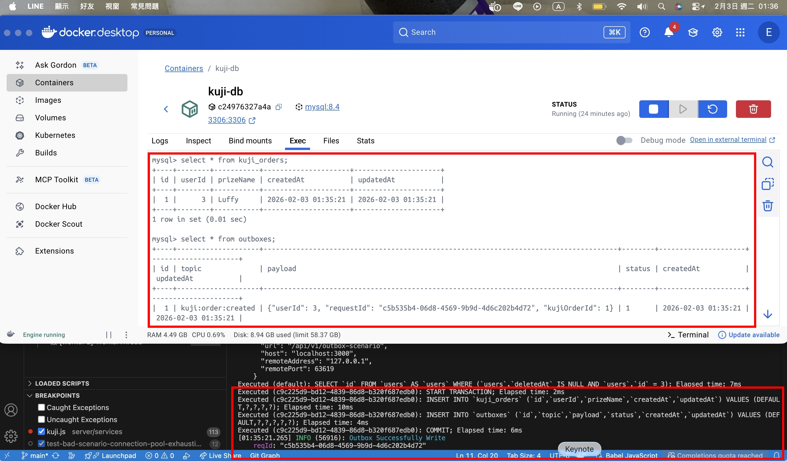
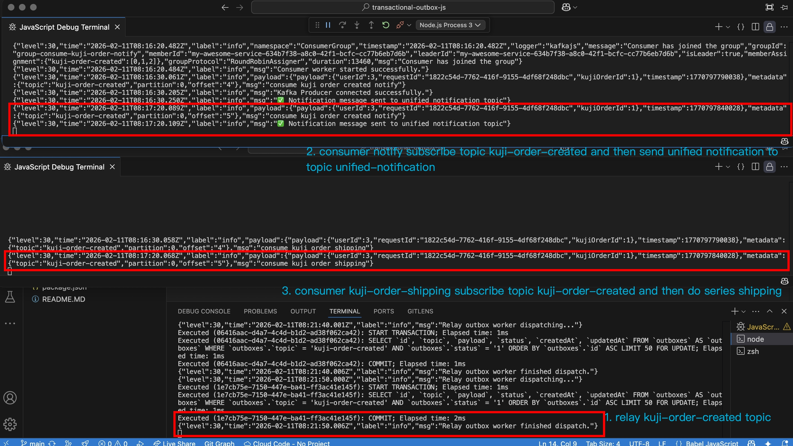

# Transactional Outbox Pattern
## 執行 flow
1. 執行程式
	- `npm run test-scenario`
	- `npm run relay-outbox`
	- `npm run consume-shipping`
	- `npm run consume-kuji-order-notify`
2. 打 api 觸發訂單建立的事件
	- [post] http://localhost:3000/api/v1/outbox-scenario
	- payload
	```json
	{
		"userId": 3,
		"prizeName": "Luffy"
	}
	```
3. 看執行結果
	- 
	- 

## 專案中的實作流程 (Code Flow)

本專案透過以下幾個獨立的背景程式 (Daemon) 來完整地實踐 Transactional Outbox 模式，並展示了微服務架構中常見的 Fan-out (扇出) 消費模式。

### 1. 事件的產生 (Event Origination)

雖然未提供 API 程式碼，但我們可以假設有一個建立訂單的 API。當該 API 被呼叫時，它會執行一個資料庫 Transaction，在其中：
1.  執行 `npm run test-scenario`。
2.  postman 打 [post] http://localhost:3000/api/v1/outbox-scenario， payload帶入
```bash
{
    "userId": 3,
    "prizeName": "Luffy"
}
```
3.  同時，在 `outboxes` 資料表中插入一筆狀態為 `PENDING` 的訊息，其 `topic` 為 `kuji-order-created` 和在 `kuji_orders` 資料表中插入一筆 order。
4.  執行結果請見 

由於這兩個操作在同一個 Transaction 中，因此保證了訂單資料和待發送的訊息要嘛都成功，要嘛都失敗，解決了雙寫問題。

### 2. 訊息中繼 (`bin/relay-outbox.js`)

這個腳本是 Outbox 模式中的「中繼器 (Relay)」，它扮演著確保訊息從資料庫可靠地傳遞到 Kafka 的核心角色。

*   **啟動方式**: 執行 `node bin/relay-outbox.js`。
*   **運作模式**:
    1.  內部使用 `croner` 套件，每 10 秒觸發一次 `dispatch` 任務。
    2.  `dispatch` 會呼叫 `daemon/relay/relay-kuji-order-created.js` 這個 Handler。
    3.  Handler 會在一個新的 DB Transaction 中，使用 `SELECT ... FOR UPDATE SKIP LOCKED` 語法，從 `outboxes` 表中安全地鎖定並讀取一批 `PENDING` 狀態的訊息。
    4.  接著，它會將這些訊息發佈到 Kafka 的 `kuji-order-created` Topic。
    5.  如果訊息成功發佈到 Kafka，Handler 會在同一個 DB Transaction 中將 `outboxes` 表中對應訊息的狀態更新為 `DONE`。
    6.  如果發佈到 Kafka 的過程中發生任何錯誤，整個 DB Transaction 會被 Rollback，訊息狀態依然是 `PENDING`，等待下一次輪詢時重試。

### 3. 事件消費 (Event Consumption)

一旦訊息進入 Kafka，下游的各個服務就可以訂閱並處理它。本專案展示了兩個獨立的 Consumer 服務，它們訂閱了**同一個 Topic**，但使用**不同的 Group ID**，這是典型的 Fan-out 場景，讓一個事件可以被多個不同業務邏輯的服務處理。

#### 消費者 A: 出貨服務 (`bin/consume-shipping.js`)

*   **啟動方式**: `node bin/consume-shipping.js`
*   **角色**: 模擬處理訂單出貨的微服務。
*   **運作模式**:
    1.  使用 `GROUP_CONSUME_SHIPPING` 這個 Group ID。
    2.  訂閱 `kuji-order-created` Topic。
    3.  當收到訊息時，執行 `consumers/shipping.js` 中的邏輯（例如：呼叫物流 API、更新庫存等）。

#### 消費者 B: 通知服務 (`bin/consume-kuji-order-notify.js`)

*   **啟動方式**: `node bin/consume-kuji-order-notify.js`
*   **角色**: 模擬處理訂單通知的微服務。
*   **運作模式**:
    1.  使用 `GROUP_CONSUME_KUJI_ORDER_NOTIFY` 這個 Group ID。
    2.  同樣訂閱 `kuji-order-created` Topic。
    3.  當收到訊息時，執行 `consumers/notifiy.js` 中的邏輯。在這個範例中，它會進一步將訊息轉發到一個統一的通知中心 Topic (`TOPIC_UNIFIED_NOTIFICATION`)，展示了事件鏈的處理模式。

### 4. 實作結果
*   因為 consumer 沒有將 fromBeginning: true 打開，所以在測試時需要將以上的程式同時執行
*   結果圖


### 總結
這個流程完美地展示了 Outbox 模式如何透過「本地交易」和「非同步中繼」來保證資料的最終一致性。同時，透過 Kafka 的發布/訂閱模型，讓下游服務可以獨立地擴展和演進，實現了高度解耦的微服務架構。
